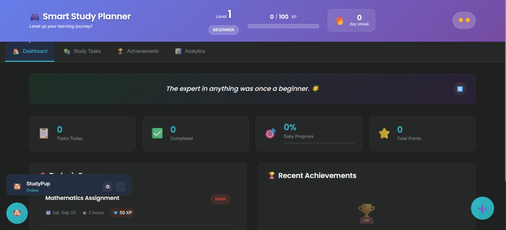
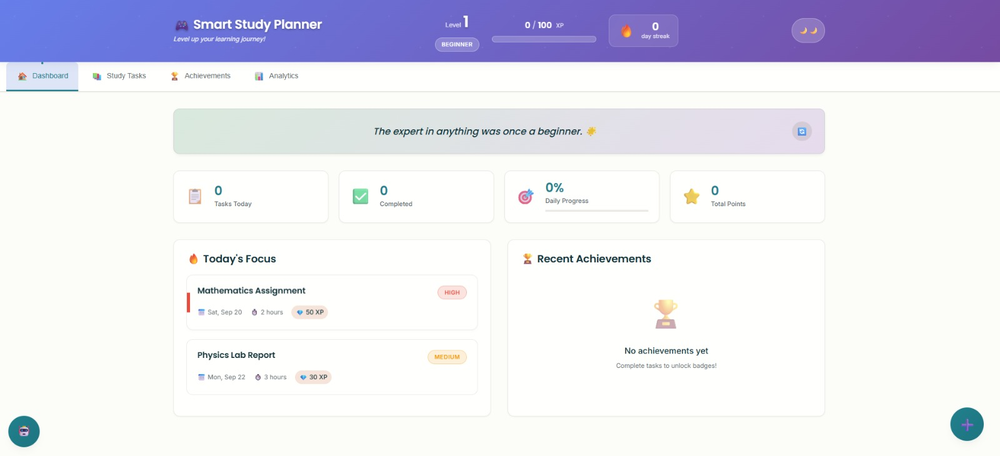
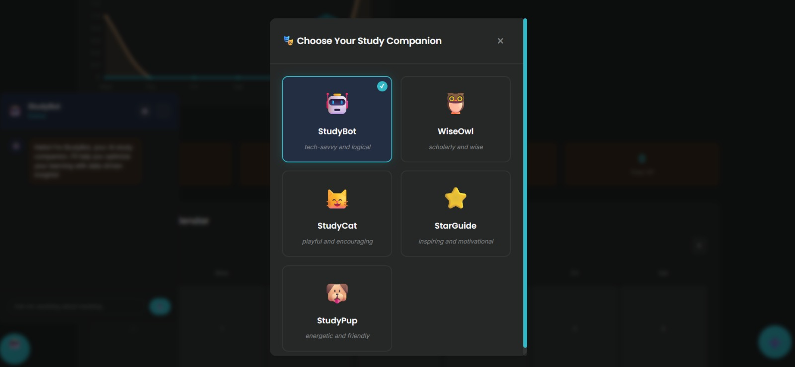
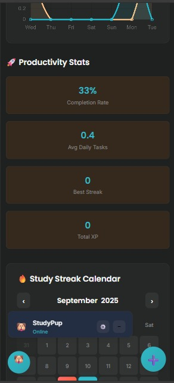

# Gamified Study Planner

A dynamic web app built with **HTML**, **CSS**, and **JavaScript** that helps students organize tasks, set goals, and track progress. It features gamified rewards like points, badges, and streaks, with a modern, responsive UI and local storage support.

## Table of Contents

* [Features](#features)
* [Screenshots](#screenshots)
* [Getting Started](#getting-started)
* [Usage](#usage)
* [Tech Stack](#tech-stack)
* [Project Structure](#project-structure)
* [How to Contribute](#how-to-contribute)
* [Contact](#contact)

## Screenshots
### 🏠 Dashboard


### ☀️ Light Mode


### ⚡ Dynamic View


### ⚡ Dynamic View (Alternate)


## Features

* Add, edit, remove study tasks
* Set goals and milestones
* Track task completion
* Earn points and badges for achievements
* Maintain streaks (e.g. consecutive days of completing tasks)
* Responsive design – works well on desktop/mobile
* Data persists via browser local storage

## Getting Started

To get a copy of the project up and running on your local machine, follow these steps:

1. **Clone** the repo:

   ```bash
   git clone https://github.com/pritisingh-09/gamified-study-planner.git
   ```

2. **Navigate** into the project directory:

   ```bash
   cd gamified-study-planner
   ```

3. **Open** `index.html` in your browser.
   (No server backend needed; runs purely client-side.)

---

## Usage

* On first load, create your tasks and set your goals.
* As you mark tasks complete, you’ll earn rewards (points / badges).
* Keep the streak going by completing daily tasks.
* Use the interface to edit or delete tasks as needed.
* All data is stored locally; clearing browser data will reset progress.

---

## Tech Stack

* **HTML5** – for content & structure
* **CSS3** – for styling and responsive layout
* **JavaScript** – for interactivity, logic, and local storage
* No external backend or database

---

## Project Structure

```text
gamified-study-planner/
├── index.html        ← Main HTML file (the UI)
├── style.css         ← Styles for layout, design
└── app.js            ← JavaScript logic: tasks, rewards, storage
└── assets/
```

---

## How to Contribute

Contributions are welcome! Here are a few ways you can help:

* Bug reports or suggestions via GitHub Issues
* New features: e.g., syncing across devices, theming, reminders
* Improving UI / UX, accessibility
* Code refactoring and making code more modular

If you want to contribute:

1. Fork the repository
2. Create a new branch: `git checkout -b feature/YourFeature`
3. Make your changes
4. Commit: `git commit -m "Add <feature name>"`
5. Push: `git push origin feature/YourFeature`
6. Open a Pull Request

---

## Contact

* **Author**: Priti Singh
* **GitHub**: [pritisingh-09](https://github.com/pritisingh-09)
* **Email**: pritisingh0904@gmail.com
